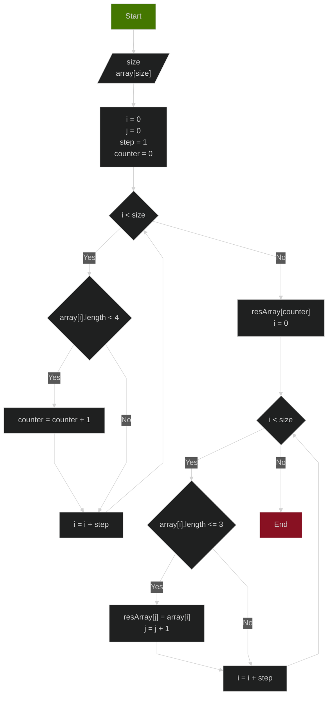

Задание:

1. Создать репозиторий на GitHub
2. Нарисовать [блок-схему алгоритма](#блок-схема)
3. Снабдить репозиторий оформленным текстовым описанием [решения](#решение)
4. Написать программу, решающую поставленную задачу
5. Использовать контроль версий в работе над этим проектом

## Задача

> Написать программу, которая из имеющегося массива строк формирует массив из строк, длина которых меньше либо равна 3 символа. Первоначальный массив можно ввести с клавиатуры, либо задать на старте выполнения алгоритма. При решении не рекомендуется пользоваться коллекциями, лучше обойтись исключительно массивами.
## Блок-схема

